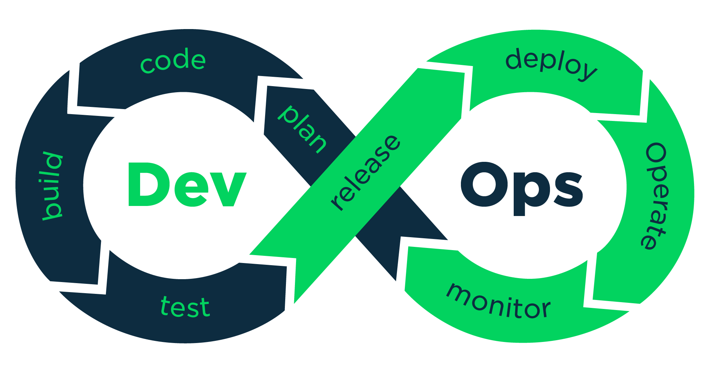

# What is "DevOps"?

- What are challenges in the application development and release process? 
- What of these challenges DevOps tries to solve? 
- What are main DevOps principles? 
- What are tasks and responsibilities of DevOps as a role? 
- What are the differences between DevOps and SRE? 

DevOps is a quiet a new concept gaining growing popularity from around the 2008. The term itself is very broad, posing some difficulties in clearly define what is it about.  

The simplest way to define what is DevOps is starting just from the name: it is an intersection fo the words "Development" and "Operations": 
- **Development:** the phase of designing, and running the application; 
- **Operations:** the phase of deploy, operating and monitoring the application. 

We can consider DevOps as the working area with the target of letting development and operations activities run *continuously* in the smoothest way possible, *minimizing development errors* and making *deployment*, *operation* and *improvement* of the application easy. 

To understand better this definition in detail, let's look inside of typical  application development activities.

## From the Idea to the User

Whatever application you are developing, your main goal is always to deliver it to your target end user. 

This target do not depend by the development approach you are using, such as waterfall or agile: in any case, at the end of the process, you want the result of your work to be used by someone else. 

> At the end of the day, is always about creating an application and delivering it to end-users. 

Typical software release process can be summarized with the following schema: 
1. Idea and/or requirements collection; 
2. Design and coding of the solution; 
3. Test of the result; 
4. Building and packaging of the result artifact;
5. Deployment of the solution in a physical place such as a public server, setting it up for the proper use;
6. Announcement to your end-users of the release of the application (or of a new version of it).

By the way, the process do not end here; indeed, while in use: 
- is necessary to monitor the application performance; 
- is necessary to track users issues and discovered bugs; 
- more in general, is necessary to track accessibility of the application and fix emerging problems. 

Moreover, during the development and deployment of the application usually possible improvements may arise in terms of features or optimizations, letting the steps from 1 to 6 previously seen repeat, indefinitely. Once an improvement, is ready ... is necessary to deliver it to the user *immediately*!

> ... How are usually changes tracked? 

The continuous iteration between ideas or requirements collections, their implementation, deployment and monitoring of and application is at the core of DevOps acitivities.

> [!NOTE]
>
> Making the process of ***continuous-delivery*** of changes ***fast*** and ***reliable*** - i.e., with minimum errors and bugs.

## Developers and Operations: Existing Frictions

Developers are responsible for coding. Operations are responsible for running the application. This strict division of responsibilities between the two parts let frictions arise. 

### Miscommunication Friction

Typical issues developers and operations might face are: 
<!-- TODO: trasforma in tabella-->
Typical issues developers might face are: 
- I cannot run the application a I wrote;
- They code the application without knowing where the application will be deployed.

Typical issues operations might face are: 
- I am running the application but I do not know how it works; 
- They run applications without knowing implementation details.

Because of such a setup, usually coding artifacts where exchanged back and forth between developers and operations. The abscence of pieces of information on one side as well as not considering running details on the other was the origin of origin of the problem, rooted in the different responsibilities the two roles must carry out. 

> [!NOTE]
> 
> As a result, we will have miscommunications between the two areas, stretching release periods from days to weeks.

Back in the days, indeed, the process was not clearly defined nor automated, but was a long, bureaucratic process manually handled, with checklists and documentations (let's think about how Linux was developed, and why `git` was born!).

### Conflict of Interest Friction

The different nature of the two roles is also stressed by the target of their jobs. Indeed: 

<!-- TODO: tabella -->
- Developers want to add and release new features *fast*;
- Operations want to maintain system stability, limiting failures and keeping the application available.

Because of the two different focuses, they have different incentives. As a consequences, developers want to speed the process up, while operations on the contrary resist to the speed of releases, slowing it down. 

Considering also the difficulties for operations in evaluating code they did not write, is possible to understand that the struggle in keeping the process both fast and reliable can easily become real. 

Despite the high level goal for both roles is delivering high level application to the end user fast apparently pushing them to collaborate, job incentives and goals work on the opposite side: developers incentives is to quickly deliver new features, while operations incentives is to maintain system stability and resist to new changes pushed out.
<!-- TODO: tabella-->

### Security Friction

In this picture, security teams work on the same side as operations teams, absolving the task of analyze and certificate the security of the application. If it is not achieved, the new release is blocked. In a traditional scenario, security checks are handled as for the operation team with bureaucracy and checklists, making the process slow and unreliable.

### Testing Friction

Several times testers are different people from developers. They test specific features, end-to-end application, deployment environments, performance and so on. 

In a traditional setup, these tests are carried out manually, and they need to be executed very carefully because are the first filter for bugs. Of course, this step slows down the releasing process. 

### Manual Work Frictions

Many of the tasks needed during the release process used to be done manually. For example operations used to do most of their activities manually either by directly executing commands on the servers to install tools, configure stuff, do patches or have scripts or small programs they execute. This manual work is slow and error prone because of human error. 

Moreover, with manual work knowledge sharing is very difficult because people who do the tasks would have to document it, and others would have to read it, which is a very time consuming and tedious task. Manual processes are also intransparent, because it is hard to trace who did what and when on every server. Replicating the exact state of a server or piece of infrastructure to backtrack problem origins is nearly impossible, and everything relies on experts memory.

The common characteristic of all these issues is that they all slow down the release cycle and create roadblocks on the application distribution way.

## DevOps Goal 

The goal of DevOps activities is to remove all mentioned frictions and alleviate associated root causes, with the final goal of speeding up the release process of any kind of application.

Tools to achieve the target mainly rely on process automations, to lower the manual labour and, consequently, limit error prone activities. As a consequence, activities can be streamlined and releasing cycle can become tighter and tighter, with an optimization level that can support releasing a software multiple times a day 

# How DevOps achieves its Targets

DevOps defines a combination of cultural philosophies, practices and tools for streamlining software development and its distribution.

In reality, DevOps is not just one set of tools or one specific concept, but it is more a combination of anything that creates the process of releasing the software fast and with high quality, letting developers and operations people work together more often together and talk to each other better.

Naturally, different companies implemented devops in different ways so the actual implementation of devops looked pretty different across different realities.
Nvertheless, since the birth of the concept, common patterns arose, letting different tools emerge and started being use across the the DevOps cycle. 

<!-- TODO: immagine dei tre ruoli --->

Accordingly, in time the DevOps Engineer role became more and more defined, with DevOps Engineers working next to developers, next to operations or in between the two areas. In simple words, the responsibility of the DevOps Engineer is: 

> to build a streamlined release process without any kind of issue slowing down the release.

<!-- TODO: immagine delle tecnologie --->

Because of this responsibility, the concept of *Continuous Integration / Continuous Deployment* arose, highlighting the main activities of DevOps Engineers. 

# Tools and Concepts to learn as a DevOps Engineer

## Development

Being a DevOps Engineer means working side-by-side with software developers. Developers teams develop an applications with different kind of stacks and languages, with the final development result collected in a ***code repository***.

One of the most used code repositories used nowadays is `git`. As a DevOps Engineer you will not develop the core of the application, but you need to know: how the developers work, which git workflow they are using, how the application is configured to talk with other applications or databases, how automated tests are configurated and used, and so on. 

## Operating Systems

The developed code need to be deployed (most of the times) on a server, so that users can access it. Consequently, an infrastructure to host the development result is needed, on-premise or in cloud. 

As a DevOps Engineer you need to prepare the infrastructure to run the application, which means you will need to interact with the most used OS in the server domain: Linux. Moreover, you will need to use the CLI, because most of the stuff is done in that way with Linux, and understand the Linux filesystem, and so on.

## Network and Security

Deploying an application means also dealing with network and related stuff. Network and networking activities are central in systems security, so, as a DevOps Engineer, you will need to know firewalls, proxy servers, load balancers, HTTP/HTTPS, letting application accessible from outside, IPs, DNSs, and so on. 

Nevertheless, it does not mean that you need to know how to administrate a server from start to finish, such as a Network and System Administratorse, or a Security Engineer: only a basic knowledge is necessary, to be able to interact with the whole infrastructure in the best way possible to deploy your target application. 

## Containers

Containers are the new (and pivotal) standard for applications deployment. It means that concepts behind virutalization and containerization are needed to be unerstood by a DevOps Engineer. The most popular containerization technology nowadays is Docker. 

## But ... Given Technologies, how to CI/CD?

<!-- 2048 -->
