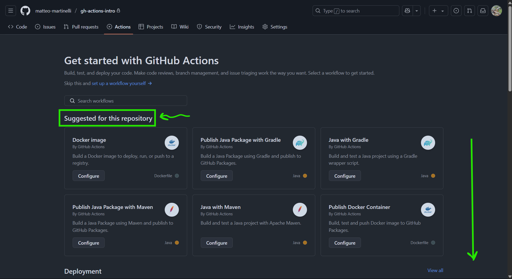

# Let's Experiment! Configuring a CI Pipeline for a Java Gradle Project

The demo presented in the video shows how to set up a basic CI pipeline for a Java project that uses Gradle as the build system.

**Practical Steps:**

1. **Creating a Repository:** Create a new repository and give it a proper name (e.g., `gh-actions-intro`). Then insert in the repository the codebase distributed in the `.zip` file.

    
    

2. **Push Local Code:** The code of a local Java Gradle application is uploaded to the remote repository.

    Note that the repository can be created in 2 ways: 
    - locally, and then be pushed on GH; 
    - Otherwise. 

    What is important, is to have the repository with the codebase available and ready to be modified and synced. 

    

3. **Accessing the "Actions" Tab:** On the main repository page, select the **"Actions"** tab.

     <!--TODO: Sistema lo screen -->

4. **Exploring Workflow Templates:** In the "Actions" section, several workflow templates are shown, grouped by category (Deployment, Continuous Integration, Build and test, Publish, etc.).

    
    

5. **Selecting the "Java with Gradle" Template:** The specific template for Java projects that use Gradle is chosen.

    

6. **Viewing and Editing the Workflow File (YAML):** When you select the template, GitHub automatically creates a pre-compiled YAML file in the `.github/workflows` directory (for example, with the name `gradle.yml`). This file contains the workflow logic.

    

    Note: is also possible to create the relative folder in your local repository, prepare the `.yaml` file, and then sync it with the remote repository.

7. **YAML File Syntax Analysis:**
    - `name`: name of the workflow describing what it does
    - `on`: the keyword `on` specifies events to listen triggering the workflow. In the actual case: 
        - `push`: everytime someone pushes in the master branch, the actual workflow is triggered
        - `pull`: everytime a pull request is created, the actual workflow is triggered

        In this case, having these two triggers makes sense, because: 
        - everytime something is pushed into the `master branch`
        
        or
        
        - everytime someone wants to merge into the `master branch`
        it makes sense to run tests to make sure errors are not introduced in the master branch.

        > [!NOTE]
        >
        > Pay attention to the name of the branch triggering the event: it may be `master` or `main`!

        A complete list of events is present here. <!-- TODO: add link -->

    - `jobs`: this section specifies all the actions that are executed when one of the events occurs. One or more `jobs` can be specified

        - `job_name`: this key specifies the name of the job it is goind to define. The name is specified as a key under the `jobs` upper-level key. In this case the `job_name` is "*build*".

        - `runs-on`: specifies the machine where the workflow will run. The destination machine can be a `gh-hosted-runner`, a `large-runner`, or a `self-hosted-runner`. More info here. <!-- TODO: add link -->
            
                For gh-hosted-runners, billings exist. They vary with respect the [usage time](https://docs.github.com/en/billing/managing-billing-for-your-products/managing-billing-for-github-actions/about-billing-for-github-actions#per-minute-rates), and the specs specified in this section. 
            
                Available options ***for public repositories*** are: 
                
                - Linux (x64, arm64)
                - Windows (x64, arm64)
                - MacOS (intel, arm64)

                Available options ***for private repositories*** are: 
                
                - Linux (x64)
                - Windows (x64)
                - MacOS (intel, arm64)

                A [free tier](https://docs.github.com/en/billing/managing-billing-for-your-products/managing-billing-for-github-actions/about-billing-for-github-actions#included-storage-and-minutes) of 500MB of storage and 2000 minutes per month of `GH-Actions` activities exists.
            
        - `permissions`: this key specifies the level of permissions the actual workflow has when it runs. 
            > [!NOTE]
            >
            > In other words, it responds the question:
            > "what can this workflow do on this repository?"

            Persmissions are set as follows:
            ``` yaml
            permissions:
              contents: read
            ``` 
            It means that the workflow has the permission to read the files in the repository. Available options for `permissions` are explained [here](https://docs.github.com/en/actions/writing-workflows/workflow-syntax-for-github-actions#jobsjob_idpermissions).

            A permission can be set to `read`, `write` or `none`. The `write` option includes `read`. If `permissions` are not specified, default values are used, which depend by the type of event triggering the workflow.

            Is also possible to defined `permissions: read-all`, `permissions: write-all`, or `permissions: {}`, which denies any permission to the workflow. It is useful when the workflow does not operate on the repository (e.g., if it only sends a notification).

        - `steps`: this section specifies the chain of actions to be executed for the given workflow. Each action is specified by the keyword `uses`, that specifies an "***action***" to be used in that particular step.

            - `uses: actions/checkout@v4`: the first action usually specified is the standard action `actions/checkout@v4`. This action takes the code of your repository, and makes it available on the runner machine speciied at the key `runs-on`. 
                > [!NOTE] <!--TODO: look if the callout tag fits the section -->
                >
                > Why is it called *checkout*? The term comes from the cash registers. In this case, the meaning is that the automation tools "taking with him" a specific version of the code to use or modify.

                > [!NOTE] <!--TODO: look if the callout tag fits the section -->
                >
                > The `actions/` path stores predefined actions, like the `checkout` action. 
                > The repository of predefined GH Actions is available [here](https://github.com/actions). 
                
                Look at the [checkout](https://github.com/actions/checkout) repository. *Actions* actually performed by this step are described into the `action.yml` file. For more specifications, look at the documentation of the given action.

                Is a good norm call the needed actions ***specifying its version***.

                Is also possible to run actions from repositories different from `actions/`. For more information, look [here](https://docs.github.com/en/actions/writing-workflows/choosing-what-your-workflow-does/using-pre-written-building-blocks-in-your-workflow#adding-an-action-from-the-same-repository). 

            - `name: Set up JDK 17`: the next step is the following: 

                ``` yaml
                - name: Set up JDK 11
                  uses: actions/setup-java@v4
                  with: 
                    java-version: 11
                    distribution: temurin
                ```
                Since the runner is not aware, at the startup, what kind of environment it must use, is necessary to specify it. 

                Since the project is a Java project, we specify the JDK version the runner must have. 

                The keyword `with` specifies a map (key:value) of the input parameters defined by the action. Each action can have one or more input parameters, like *functions*. Such parameters can be passed at the keyword `with`.
            
            - `name: Setup Gradle`: the next step is the following: 

                ``` yaml
                - name: Setup Gradle
                  uses: gradle/actions/setup-gradle@af1da67850ed9a4cedd57bfd976089dd991e2582 # v4.0.0
                ```
                This step set ups Gradle, taking the action from a *different repository*(`gradle/actions/setup-gradle@...`). 

            - `name: Build with Gradle`: the next step is the following: 
                ``` yaml
                - name: Build with Gradle
                  run: ./gradlew build
                ```
                In this case, the step runs a linux command specified at the key `run`. This specific command launches the build of the java codebase passed to the runner.

    In the following, the complete `.yaml` file of the workflow: 

    ```yaml
    name: Java CI test with Gradle

    on:
      push:
        branches: [ "main" ]
      pull_request:
        branches: [ "main" ]

    jobs:
      build:

        runs-on: ubuntu-latest
        permissions:
          contents: read

        steps:
          - uses: actions/checkout@v4
          - name: Set up JDK 11
            uses: actions/setup-java@v4
            with:
              java-version: '11'
              distribution: 'temurin'

        # Configure Gradle for optimal use in GitHub Actions, including caching of downloaded dependencies.
        # See: https://github.com/gradle/actions/blob/main/setup-gradle/README.md
        - name: Setup Gradle
          uses: gradle/actions/setup-gradle@af1da67850ed9a4cedd57bfd976089dd991e2582 # v4.0.0
        
        - name: Grant execute permission for gradlew
          run: chmod +x gradlew

        - name: Build with Gradle Wrapper
          run: ./gradlew build
    ```

8. **Commit Workflow File:** The YAML file is committed to the repository.

    
    

9. **Workflow Triggers:** By creating a new branch, making changes and opening a pull request to the `master` branch, the `pull_request` event defined in the YAML file is triggered and the workflow starts executing. It is also possible to trigger the workflow directly with a push to the `master` branch.

10. **Execution Monitoring:** In the "Actions" tab, you can view the workflow execution status (in progress, completed, failed) and the details of each step (log, executed commands).

    

11. **Execution Environment:** Workflows on GitHub Actions run on **servers managed by GitHub**. You do not need to configure or maintain your own servers. For each *job within a workflow*, a new virtual server is **prepared**.

12. **Parallel Job Execution:** By default, multiple jobs defined in a workflow are executed in parallel. You can define dependencies between jobs using the `needs` keyword.

13. **Operating System Choice:** The `runs-on` attribute can specify different operating systems provided by GitHub: `ubuntu-latest`, `windows-latest`, `macos-latest`. You can use a **strategy (strategy) and a matrix (matrix)** to run the same job on multiple operating systems or with different configurations (e.g., different versions of Java). More information [here](https://docs.github.com/en/actions/writing-workflows/choosing-what-your-workflow-does/running-variations-of-jobs-in-a-workflow).

## Extending the CI Pipeline: some additional steps, building and pushing the Docker Image

- The result of the building process using Gradle is a `.jar` artifact. Such artifact must be return by the workflow. To do it, let's add the following code in the `.yaml` file: 

    ``` yaml
    - name: Upload JAR artifact
      uses: actions/upload-artifact@v4
      with:
        name: my-app-jar
        path: build/libs/*.jar
    ```

    The artifact will be available in the summary page of the workflow result

    
    
    
- An additional check that can enhance the workflow is a check about the existance of the java built file on the host machine. To do it, add the following code in the `.yaml` file: 

    ``` yaml
    - name: List generated JARs
      run: ls -l build/libs
    ```

    the output will then be visible in the execution monitoring page, as a log. 

Now that the building step is enriched with some additional steps, we can dig on how to extend the CI pipeline to **build a Docker image of your Java application and push it to a private Docker Hub repository**.

**Practical Steps:**

1. **Creating a Docker Hub Account and Private Repository:** navigate to [https://hub.docker.com/](https://hub.docker.com/) and craete a new account. 

    The account has a free tier, with the possibility of creating one private docker-repository. Create it, as it will be useful in the next steps.

    

2. **Adding a Step to Build and Push Docker Image:** the new step will take care of building the docker image, following the instructions present in the `Dockerfile` present in the repository. 

    To add the step, let's start adding the name by writing: 

    ``` yaml
    - name: Build and push Docker image
    ```

3. **Using a Predefined Docker Action:** It is possible to manually write all the Docker commands (`docker login`, `docker build`, `docker tag`, `docker push`) in our workflow.

    ``` yaml
    run: |
        docker login ...
    ```

    By the way, to make the workflow leaner, we can also use a **pre-existing action from the GitHub Actions marketplace** (in the example, `mr-smithers-excellent/docker-build-push@v6`).

    To find such actions (and other potential actions that can be useful for further extensions), is enough to search on Google with the query "`docker build and push github action`", or to take a look on the [GitHub Marketplace](https://github.com/marketplace?query=docker+build+and+push&type=actions) with a similar research.

4. **Configuring Docker Action Parameters:** The selected Docker action accepts several parameters to configure the build and push of the image. Important parameters include:
    * **`registry`:** The URL of the Docker registry (for Docker Hub this is `docker.io`).
    * **`repository`:** The name of the Docker repository (usually `<docker_id>/<repository_name>`). In my case, is: 
    
        ``` yaml
        image: mmartinelli91/gh-actions-app
        ```

    * **`username`:** The username for logging into the Docker registry.
    * **`password`:** The password for logging into the Docker registry.
    * **`push`:** A boolean to indicate whether the image should actually be pushed (by default set to `true`).

5. **Credential Management with GitHub Secrets:** To avoid storing sensitive credentials directly in the YAML file, **GitHub Secrets** can be used. Secrets can be created in the repository settings (Settings -> Secrets -> Actions) with specific names (for example, `DOCKER_USERNAME` and `DOCKER_PASSWORD`).

    
    

6. **Referencing Secrets in the Workflow:** In the YAML file, credentials are referenced using the syntax `secrets.<name_of_secret>` (for example, `secrets.DOCKER_USERNAME`).

    The result is like the following: 

    ``` yaml
    username: ${{ secrets.DOCKER_USERNAME }}
    password: ${{ secrets.DOCKER_PASSWORD }}
    ```

    The new step will be result like the following: 
    
    ``` yaml
    - name: Build and push Docker image
      # Action take from: https://github.com/marketplace/actions/docker-build-push-action
      uses: mr-smithers-excellent/docker-build-push@v6
      with:
        image: mmartinelli91/gh-actions-app
        tags: v1, latest
        registry: docker.io
        username: ${{ secrets.DOCKER_USERNAME }}
        password: ${{ secrets.DOCKER_PASSWORD }}
    ```

7. **Modifying the `runs-on` Attribute (Optional):** Since Docker is pre-installed on the Ubuntu agents provided by GitHub Actions, the example focuses on using `ubuntu-latest` for this step.

8. **Updated, Commit and Triger:** Commit the changes to the file. Look at the logs of the triggered workflow, and adjust if needed

10. **Verify on Docker Hub:** After the workflow has finished running, verify that the new Docker image has actually been pushed to the private Docker Hub repository. 

    The `docker/build-push-action` action adds a tag to the Docker image that includes the branch name by default. You can customize the tag using the `tags` parameter of the action.

    

## Resulting Workflow

In the following the resulting workflow, represented in our `.yaml` file, is reported:

``` yaml 
name: Java CI test with Gradle

on:
  push:
    branches: [ "main" ]
  pull_request:
    branches: [ "main" ]

jobs:
  build:

    runs-on: ubuntu-latest
    permissions:
      contents: read

    steps:
    - uses: actions/checkout@v4
    - name: Set up JDK 11
      uses: actions/setup-java@v4
      with:
        java-version: '11'
        distribution: 'temurin'

    # Configure Gradle for optimal use in GitHub Actions, including caching of downloaded dependencies.
    # See: https://github.com/gradle/actions/blob/main/setup-gradle/README.md
    - name: Setup Gradle
      uses: gradle/actions/setup-gradle@af1da67850ed9a4cedd57bfd976089dd991e2582 # v4.0.0
    
    - name: Grant execute permission for gradlew
      run: chmod +x gradlew

    - name: Build with Gradle Wrapper
      run: ./gradlew build
    
    # Adding the creationg of a JAR artifact. The artifact will be available in the summary page of the workflow result
    - name: Upload JAR artifact
      uses: actions/upload-artifact@v4
      with:
        name: my-app-jar
        path: build/libs/*.jar
    
    # Step to check if the java file built exists
    - name: List generated JARs
      run: ls -l build/libs

    # Pushing the building result as Docker image in DockerHub - commands or action?  
    - name: Build and push Docker image
      # Action take from: https://github.com/marketplace/actions/docker-build-push-action
      uses: mr-smithers-excellent/docker-build-push@v6
      with:
        image: mmartinelli91/gh-actions-app
        tags: v1, latest
        registry: docker.io
        username: ${{ secrets.DOCKER_USERNAME }}
        password: ${{ secrets.DOCKER_PASSWORD }}
```

## Conclusions and Further Possibilities

We have seen how GitHub Actions is a powerful and flexible tool for automating not only basic CI pipelines for building and testing applications, but also for extending these pipelines to include containerization with Docker and publishing images to private registries.

GitHub Actions offers many other automation possibilities, including:

* Deploy Docker images to cloud or Kubernetes environments
* Test and build Node.js applications
* Automate other development workflows
